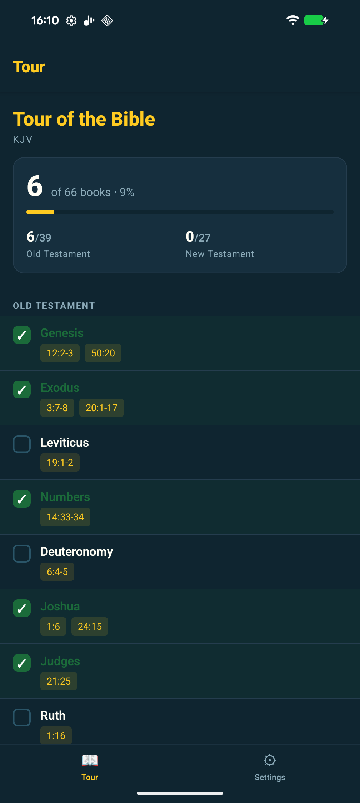
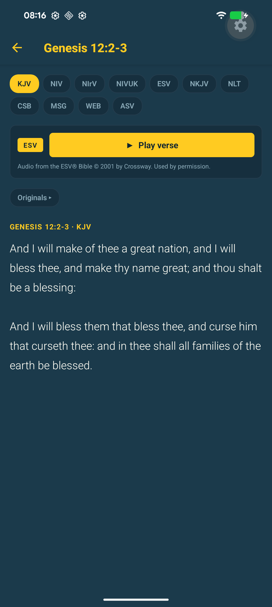
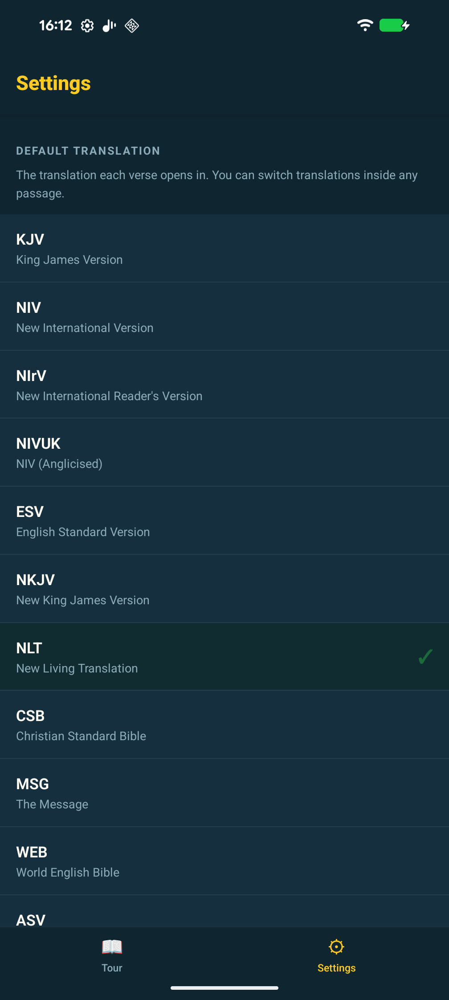
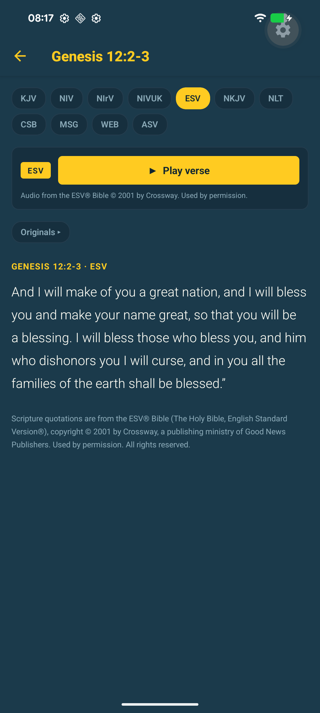
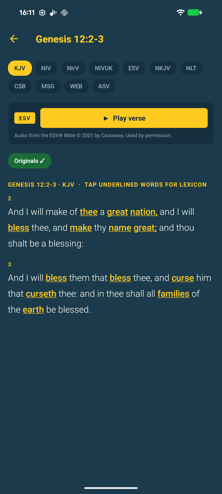
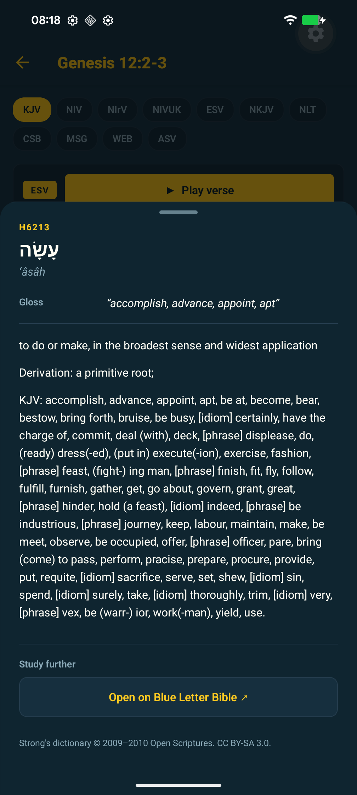

Tour of the Bible has a mobile app now. iOS is on the App Store. Android is in closed testing on Google Play, walking out the 14-day clock that Google now imposes on every new developer account before they let you near the production track. The same JavaScript bundle drives both apps and the website it grew out of.

I expected this to be straightforward. The reading-plan logic, the verse fetcher, the lexicon, the audio player — all of that already existed in the [web version](https://bible-tour.vercel.app). I told myself I was wrapping it for a phone.

The code part was true. Almost everything else wasn't.

## What going mobile actually meant

The website is a single-page Next.js app on Vercel. It proxies the YouVersion and Crossway APIs server-side so the keys never reach the browser. Progress lives in the browser's `localStorage`. There is no database, no auth, no analytics SDK.

I wanted the same shape on mobile. Same proxy. Same on-device storage. Same lack of user account. Same lack of telemetry. The only architectural change was that the components needed to render in React Native instead of HTML, and the network calls would come from a phone instead of a Chrome tab.

So: Expo SDK 55 on React Native 0.83, Expo Router for navigation (file-based, almost identical to the Next.js App Router I already knew), EAS for the native compile and signing, expo-audio for ESV verse narration that survives backgrounding. The Strong's lexicon ships as a precomputed JSON inside the bundle. There is no runtime database to manage because there is no runtime database.

The new code came to a few thousand lines of TypeScript, mostly screen layout and audio session glue. That part went quickly.

<div style="display:flex;gap:1rem;flex-wrap:wrap;justify-content:center;margin:2rem 0;">
  <figure style="margin:0;flex:1;min-width:200px;max-width:280px;">
    
    <figcaption style="font-size:0.85rem;text-align:center;opacity:0.7;margin-top:0.5rem;">The tour: 66 books, tap to start.</figcaption>
  </figure>
  <figure style="margin:0;flex:1;min-width:200px;max-width:280px;">
    
    <figcaption style="font-size:0.85rem;text-align:center;opacity:0.7;margin-top:0.5rem;">A verse modal in reading mode.</figcaption>
  </figure>
  <figure style="margin:0;flex:1;min-width:200px;max-width:280px;">
    
    <figcaption style="font-size:0.85rem;text-align:center;opacity:0.7;margin-top:0.5rem;">Settings — no account in sight.</figcaption>
  </figure>
</div>

## How I actually built it

Most of this was written with [Claude Code](https://www.claude.com/product/claude-code) sitting in my terminal. I want to be honest about what that means in practice, because "I built it with AI" is a phrase that has started to mean nothing.

A few things I noticed.

If I gave Claude the whole source of a file rather than just the function I was editing, the suggestions respected what was already there. If I gave it a snippet, the suggestions read fine on their own and quietly broke the surrounding code. Same model, same prompt, vastly different output, just because of context. Most of the "the AI wrote bad code" stories I see boil down to this. People hand it half a problem and then complain it gave back half an answer.

Smaller asks were better. "Add a Strong's lexicon overlay" gives you a sweeping rewrite. "Extract the existing modal into its own component first, and then I'll add the overlay in a follow-up" gives you something you can read in thirty seconds and accept. The model is perfectly capable of large changes. The problem is large changes are hard to audit, and unaudited changes are how you ship things you regret.

I wrote a lot of negative constraints up front. "No analytics. No third-party SDKs. No backend storage. No accounts." That single specification probably saved me a half-day of nudging the model away from the React-Native default of bolting on Sentry, Firebase, and a registration screen.

Boilerplate is where the model earned its keep. EAS config, app.json scaffolding, Expo Router file structure, the dozen pages of React Native StyleSheet declarations that every screen needs — that's where I let it cook and saved my actual brain for the audio session and the lexicon highlighting tokenizer.

When something didn't work the fastest fix was almost always to paste the exact error in and say what I expected. Not because the model is smarter than me. Because I'd lose ten minutes finding the right line and it would lose ten seconds.

The conversation log over this two-week stretch ran to hundreds of turns. I'd guess about 80% of the lines of code in the mobile app were typed by Claude first. About 100% of the decisions about what to build and why were mine. That ratio felt right.

I'll say something opinionated here, since it's the elephant in the room. I don't care which keystrokes wrote which lines. I care whether the thing works, whether it's honest about what it does, and whether I can fix it next time it breaks. By all three measures the code in this repo is better than what I'd have produced solo, in a fraction of the time. Anyone telling you that you're "not really shipping" if you used a model is selling you something — usually their own ego.

## The submissions stuff is where the time really went

The actual build was three days of work. The remaining ten days were forms.

To get an iOS app onto the App Store you need a developer account, a distribution certificate, a provisioning profile, an App Store Connect listing with a name, subtitle, promo text, full description, keywords, screenshots in three different device-class sizes, the age-rating questionnaire, the App Privacy nutrition label, a copyright line, support URL, marketing URL, privacy policy URL, age rating answers, an export-compliance declaration about whether your app uses encryption, and the actual binary. There is also a Privacy Manifest XML that lives inside the app bundle and declares exactly which iOS APIs you call and why, with reason codes you have to look up. UserDefaults access, for example, is reason code CA92.1. That is a real number you have to know about.

Google Play is comparable in scope and considerably harder if you're a new developer. You need a $25 one-off account fee, a listing with a short description (80 chars), a long one (4,000 chars), a feature graphic at exactly 1024×500, a 512×512 icon, phone screenshots, content rating, target audience, ads declaration, news-app declaration, government-app declaration, COVID-19 declaration, financial-features declaration, app-access declaration, the Data Safety form (which is a more granular cousin of Apple's nutrition label), and a privacy policy URL.

And then the policy that genuinely caught me out. Since November 2023, personal Play developer accounts must run a closed test with at least 12 active testers for 14 consecutive days before the production track even unlocks. There is no exception. There is no waiver. There is no fast-track. You wait the fortnight or you don't ship. I am, as I write this, sitting in the middle of that fortnight.

The Data Safety form alone has 26 sub-questions across 13 categories, and every "no" still requires a confirmation click. Most days towards the end I spent more time inside App Store Connect and Play Console than in my code editor.

I am not complaining. I am telling you, because nobody told me.

## Things that actually broke

A few specifics that other React Native devs might run into.

I inherited a `package.json` where the `expo` package was on `~54.0.33` but every individual Expo module had been bumped to `^55.x` at some point. iOS builds tolerated this. Android Kotlin compilation rejected it instantly with an `Unresolved reference 'service'` error coming out of `expo-constants`. The fix was running `expo install expo@^55` to align the SDK, then `expo install --check --fix` to pull every other module to its blessed version. Lesson: pin your SDK and never mix.

The mobile app lives in a `mobile/` folder inside the larger website repo. Both have their own `node_modules` with their own `react`. Metro's resolver walks up the tree by default, finds two reacts at different versions, and gets confused in a way that surfaces three layers down the stack. The fix is a tiny `metro.config.js` that pins resolution to the mobile folder only:

```js
config.resolver.disableHierarchicalLookup = true;
config.resolver.nodeModulesPaths = [path.resolve(__dirname, 'node_modules')];
```

The most annoying one was `RECORD_AUDIO`. Google Play kept demanding a privacy-policy URL because the AAB declared the permission. We don't record any audio. The permission was being merged into our final `AndroidManifest.xml` from `expo-audio`'s own manifest, because expo-audio supports recording even though we only use the playback half of it. Native dependencies merging permissions you didn't ask for is, I learned, a thing that just happens on Android. The fix turned out to be a 25-line config plugin that injects `tools:node="remove"` to strip the permission at manifest-merge time:

```js
manifest['uses-permission'].push({
  $: { 'android:name': 'android.permission.RECORD_AUDIO', 'tools:node': 'remove' },
});
```

A couple of hours to track down. Twenty minutes to fix.

The first Apple submission got rejected on guideline 2.5.4: background audio mode declared but no audible content found. The reviewer hadn't found the play button. It lives inside a verse modal, only on the ESV translation, behind a translation pill switcher. Three taps deep. I didn't need to change the binary; I just needed to send step-by-step reproduction instructions and a screen recording through the Resolution Center. Approved on the next pass. The lesson there is that App Review is run by people, not robots, and people benefit from being told where to look.

<figure style="margin:2rem auto;max-width:300px;">
  
  <figcaption style="font-size:0.85rem;text-align:center;opacity:0.7;margin-top:0.5rem;">The play button Apple's reviewer couldn't find — ESV translation, verse modal.</figcaption>
</figure>

And then a verse-range bug nobody had caught on the web app, which is mildly humiliating: Originals mode, the Hebrew/Greek lexicon view, was only displaying the first verse of any multi-verse reference. The reading plan is full of ranges like `Genesis 12:2-3` and `Exodus 20:1-17`. The token lookup function used `String(ref).match(/^(\d+):(\d+)/)`, which captured only the first verse number. Two hours of debugging, six lines of new logic. Both apps got the fix because the lexicon code is shared. That, as a bonus, is the single best argument for a shared core: when you find a bug, you fix it once.

<div style="display:flex;gap:1rem;flex-wrap:wrap;justify-content:center;margin:2rem 0;">
  <figure style="margin:0;flex:1;min-width:200px;max-width:300px;">
    
    <figcaption style="font-size:0.85rem;text-align:center;opacity:0.7;margin-top:0.5rem;">Originals mode — the lexicon view that was silently dropping verses 2 onward.</figcaption>
  </figure>
  <figure style="margin:0;flex:1;min-width:200px;max-width:300px;">
    
    <figcaption style="font-size:0.85rem;text-align:center;opacity:0.7;margin-top:0.5rem;">Tap a word, get the Strong's entry.</figcaption>
  </figure>
</div>

## The workflow that emerged

A pattern shook out for the mechanical bits of mobile shipping that I'll keep using.

Code change locally with Claude in the loop. `npx expo run:ios` or `expo run:android` to a connected device or simulator. Hot-reload covers most iterations, which is a much nicer feedback loop than I'd had on previous mobile work. When I needed a real signed AAB or IPA to upload, I'd kick off `eas build --platform android --profile production --non-interactive` in a background task and keep working. EAS handles auto-submit for Android. iOS submission I kept manual, because pushing a new build cancels any in-progress App Review and I didn't want to keep restarting the queue.

The piece I underestimated was state across sessions. Every time I started a new Claude Code conversation, I had it read the todo list first. Continuity across sessions came from that file, not from the model's memory. I'd update it at the end of each working session as if I were briefing a colleague who was about to take over from me. Honestly, that one habit was the difference between three coherent sessions and three chaotic ones.

## What I'd do differently

I'd set up Closed Testing with twelve testers as the very first Play release, not after a few rounds of internal testing. The 14-day clock starts whenever you start it, so you might as well start it on day one of the project. I'd also use `expo-build-properties` from the beginning to declare every Android permission stripping rule explicitly, instead of discovering them when Play rejects an AAB.

Screenshots: I'd generate them inside the simulator at the device size each store category demands, rather than capturing native and resizing. Saves a round of rejection.

And I'd write the Notes for Reviewer text upfront, not when Apple asks for it. That alone would have prevented the 2.5.4 rejection if I'd explained the audio-discovery path on the first submission.

## The takeaway, such as it is

A small, principled app can ship for free in two weeks. The hard parts are not the code. The platforms have made distribution paperwork the actual barrier to entry, which means a working app and a finished app are weeks apart. Knowing that going in changes how you scope the work.

I came out of this thinking that pair-programming with a model, done seriously, is the most leveraged software work I've ever done. The leverage isn't in writing more code. It's in spending your attention only on the decisions that need a human, and letting the model handle the bits where the value of careful human attention is approximately zero.

If you're thinking about shipping your own small thing, ship it. The friction is real. It's also entirely known, well-mapped, and survivable. None of it is the bit that should stop you.

## If you want to try it

On iOS, it's live. Search "Tour of the Bible" in the App Store, or use the badge below. It's free and there's no account to make.

<p style="margin:1.5rem 0;">
  <a href="https://apps.apple.com/app/tour-of-the-bible/id6764106620" style="display:inline-block;">
    
  </a>
</p>

On Android, it's still in the 14-day closed-testing window I mentioned earlier, and I genuinely need around twelve active testers to satisfy Google's requirement before the production track unlocks. So if you sign up, you're not just trying it — you're helping me ship. To join: tap the badge below and follow the steps. It involves joining a Google Group with the Gmail address tied to your Play Store account, then opting into the testing track. Once you're in, the app installs from the Play Store like any other app.

<p style="margin:1.5rem 0;">
  <a href="https://bible-tour.vercel.app/beta" style="display:inline-block;">
    
  </a>
</p>

If you'd rather not install anything at all, the original web version is still at [bible-tour.vercel.app](https://bible-tour.vercel.app) and does most of what the mobile apps do.

Bug reports, feature requests, "this verse is rendering weirdly" notes — email me at bibletour@askadam.cloud, or open an issue on [the repo](https://github.com/adamswbrown/bible-tour). Both get read.

— Adam

*[Tour of the Bible on the App Store](https://apps.apple.com/app/tour-of-the-bible/id6764106620) · [Android beta](https://bible-tour.vercel.app/beta)*
